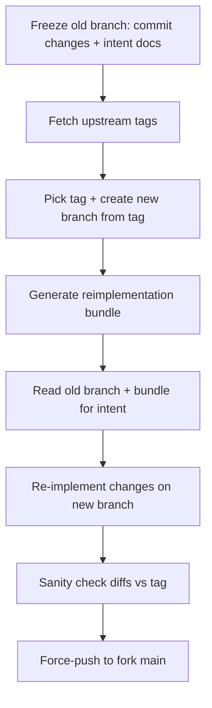

# Codext

An opinionated Codex CLI. This is strictly a personal hobby project, forked from openai/codex.


> [!IMPORTANT]
> **DO NOT USE IN PRODUCTION.**
> To keep upstream sync easy, we do not write test code for what we changed. This project is for experimental use only.

* **DX Focused:** Focus strictly on optimizing developer experience, **without adding new features**.
* **Upstream Sync:** We sync with the upstream repository regularly.

## Quick Start

Choose one of these two ways:

* Install from npm:

```shell
npm i -g @loongphy/codext
```

* Build from source:

```shell
cd codex-rs
cargo run --bin codex
```

## Features

> Full change log: see [CHANGED.md](./CHANGED.md).

* `Ctrl+Shift+C` in the TUI composer copies the current draft to the system clipboard; `Ctrl+C` keeps its existing behavior, and empty drafts still fall back to the old `Ctrl+C` path.
* TUI status header with model/effort, cwd, git summary, and rate-limit status.
* Collaboration mode presets accept per-mode overrides and default to the active `/model` settings. Example:

  ```toml
  # config.toml
  [collaboration_modes.plan]
  model = "gpt-5.4"
  reasoning_effort = "xhigh"

  [collaboration_modes.code]
  model = "gpt-5.4"
  ```

* TUI watches `auth.json` for external login changes and reloads auth automatically, with a warning on account switch. This works well with [codex-auth](https://github.com/Loongphy/codex-auth) when you refresh or switch login state outside the TUI.
* AGENTS.md and project-doc instructions are refreshed on each new user turn, and Codex shows an explicit warning when a refresh is applied.

## Project Goals

We will never merge code from the upstream repo; instead, we re-implement our changes on top of the latest upstream code.

Iteration flow (aligned with `.agents/skills/codex-upstream-reapply`):



## Skills

When syncing to the latest upstream codex version, use `.agents/skills/codex-upstream-reapply` to re-implement our custom requirements on top of the newest code, avoiding merge conflicts from the old branch history.

Example:

```
$codex-upstream-reapply old_branch feat/rust-v0.94.0, new origin tag: rust-v0.98.0
```

## Credits

Status bar design reference: <https://linux.do/t/topic/1481797>
